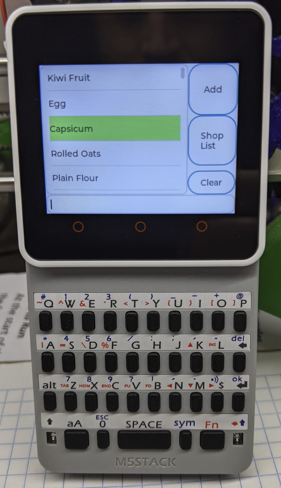

# Grocy Pad

This is a Micropython + LVGL project that aims to provide an electronic shopping list that integrates to
[Grocy](https://github.com/grocy/grocy). It's designed to run on an [M5Stack Core2](https://www.aliexpress.com/item/1005001664431732.html) board with the [Faces QWERTY](https://www.aliexpress.com/item/4001317282096.html) I2C keyboard and a [joiny thinger](https://www.aliexpress.com/item/4000370323525.html).

It should run on other ESP32-based hardware with suitable modification. Do yourself a favour and get something with some PSRAM though.




## Videos

https://www.youtube.com/playlist?list=PLT7ckgz8vcoZQXg738lWLX3vyoRwWtYmF

## Setup

Use M5Burner (Closed source software! Boo! Hiss!) to write the latest version of the UIFlow firmware to your device.

Since you can't really trust software you can't build yourself, I recommend blocking the MAC address of your device in your router such that it cannot contact the internet. It's what I did.

You may like to use the `write.py` script to help with flashing things to your device directly via serial. It uses `ampy` under the hood.

Create a `secrets.py` and include that on your device, along with everything in the `src` directory.

```python
ssid = 'myverysecretssid'
password = 'myequallysecretpassword'
grocy_api_key = 'beansbeansbeansbeansbeansbeansbeans'
grocy_domain = 'http://192.168.1.100:3000'
```